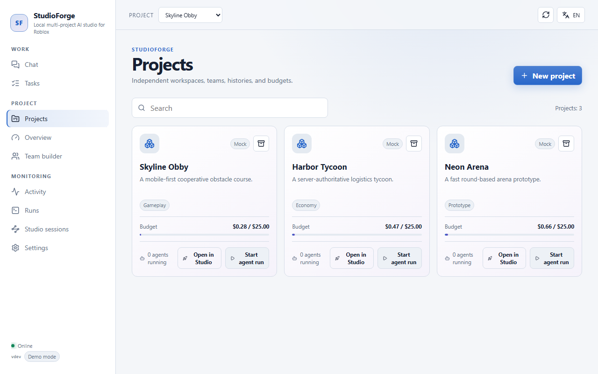
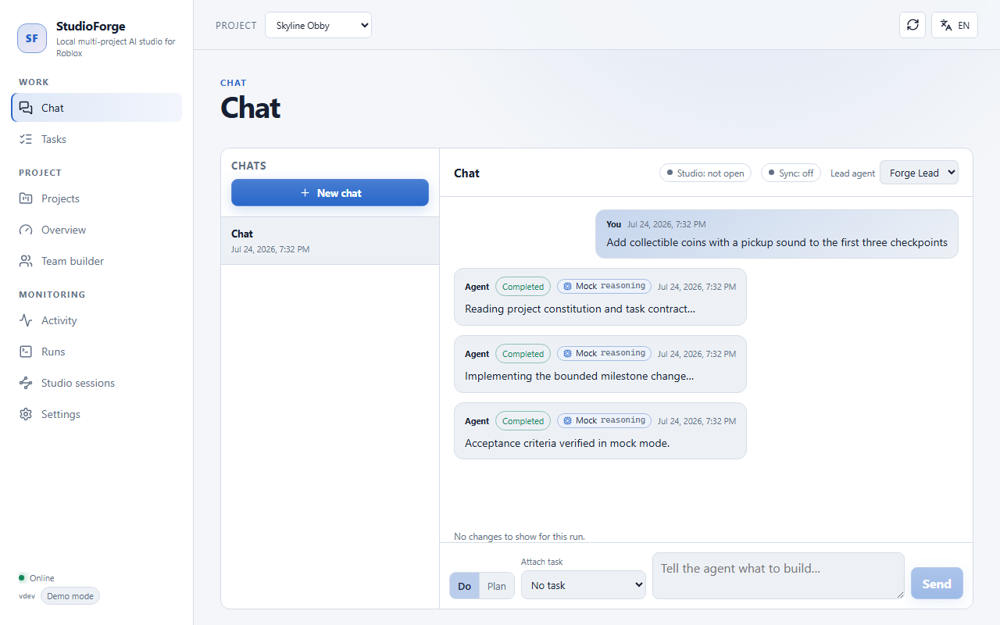
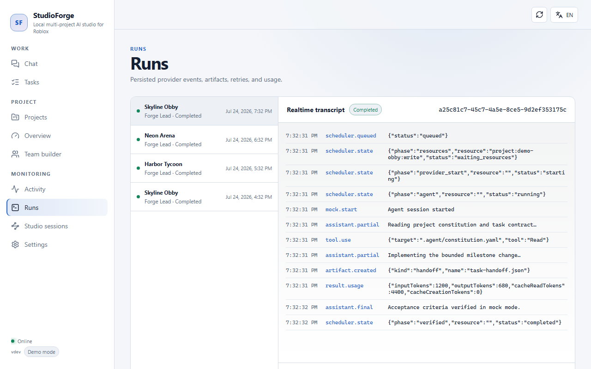
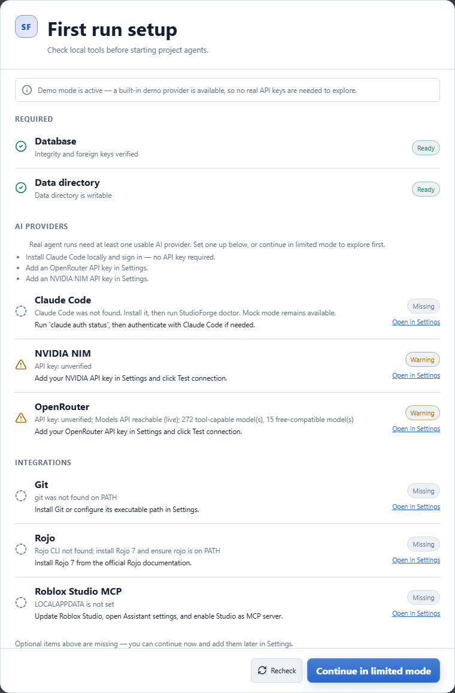

# StudioForge

[Русская версия](README.ru.md)

> [!WARNING]
> StudioForge is pre-release beta software. Back up your projects (Git or a copy) before running an agent against them, and expect rough edges — see [Known limitations](docs/KNOWN_LIMITATIONS.md).

**You describe what you want built, in chat. AI agents write the code, build the place, and test it — inside your own Roblox Studio, on your own machine.**

StudioForge is a free, open-source app that sits between you and AI coding models, and manages a Roblox project the way a human lead would: one project at a time, with a paper trail, a budget, and an undo button.

<i>Data shown is the built-in <code>--mock</code> demo (Skyline Obby / Harbor Tycoon / Neon Arena), not a live project.</i>

## What you can do

- **Chat your way to a build.** Type what you want, or use a slash command like `/build`, `/playtest`, `/task`, or `/plan` to steer an agent without knowing the syntax underneath.
- **Run more than one project.** Each project keeps its own agents, chat history, and spending limit, so a tycoon game and an obby you're prototyping never bleed into each other.
- **Watch a run as it happens, and undo it.** Every step an agent takes streams into the chat live; StudioForge checkpoints your project in Git before it touches anything, so you can see the diff and roll back a run you don't like.
- **Use free AI models.** StudioForge works with OpenRouter's free-tier models and NVIDIA's free hosted models out of the box — you only need a free API key, not a paid subscription. Claude Code is also supported if you already use it.
- **Keep everything local.** Your project files, your Roblox Studio, your Git history — all on your computer. StudioForge is a program you run yourself; nobody else's server sees your project.

## See it in action

<i>Sending an instruction to an agent and watching the run stream — <code>--mock</code> demo data.</i>

<i>Every run is checkpointed in Git first, so you get a diff and a one-click rollback — <code>--mock</code> demo data.</i>

<i>The first-run wizard confirms Studio, Git, and your AI provider before you start.</i>

## What you need

- **Roblox Studio**, with its built-in MCP server turned on (a toggle in Studio's Assistant menu — no plugin to install).
- **A free API key** from [OpenRouter](https://openrouter.ai/) or [NVIDIA](https://build.nvidia.com/), so StudioForge has a model to talk to. (Claude Code works too, if you already have it installed and signed in.)
- **Windows 10/11 (64-bit)** or **macOS on Apple Silicon**.

## Quick start

1. Download the latest release zip for your OS from the [Releases page](https://github.com/10kkyvl/studioforge/releases).
2. Unzip it anywhere you have write access.
3. Run `studioforge.exe` (Windows) or open `StudioForge.app` (macOS). A browser tab opens on its own with the app already signed in.
4. The first-run checks confirm Studio, Git, and your chosen AI provider are found — fix anything flagged red, then continue.
5. Open **Settings**, paste your free OpenRouter or NVIDIA API key, and click **Test connection**.
6. Create a project pointing at your Roblox project folder (or a new empty one), then tell it what to build in the chat.

Windows may show a SmartScreen warning and macOS may ask you to Control-click → Open, because these builds aren't code-signed yet — see the beta note below. Full walkthrough, including Rojo setup: [docs/GETTING_STARTED.md](docs/GETTING_STARTED.md).

## Beta note

StudioForge is a public beta, not a finished product. Before pointing it at a project you care about:

- **Back it up.** A Git repo (StudioForge checkpoints before every run) or a plain copy both work.
- **Expect unsigned builds.** Windows SmartScreen and macOS Gatekeeper will both warn on first launch — this is expected for an unsigned development build, not a sign of a compromised download. Verify the release checksum if you want extra assurance.
- **Some features are still rough or partial.** Task dependencies, for example, are tracked but not yet enforced before a run starts. The full list: [docs/KNOWN_LIMITATIONS.md](docs/KNOWN_LIMITATIONS.md).

## Want more?

|                                          |                                                                       |
| ---------------------------------------- | --------------------------------------------------------------------- |
| **Full guide**                           | [docs/en/README.md](docs/en/README.md) · [Русский](docs/ru/README.md) |
| **Getting started (step by step)**       | [docs/GETTING_STARTED.md](docs/GETTING_STARTED.md)                    |
| **Known limitations**                    | [docs/KNOWN_LIMITATIONS.md](docs/KNOWN_LIMITATIONS.md)                |
| **Architecture** (for developers)        | [docs/ARCHITECTURE.md](docs/ARCHITECTURE.md)                          |
| **Development setup** (for contributors) | [docs/DEVELOPMENT.md](docs/DEVELOPMENT.md)                            |
| **Contributing**                         | [CONTRIBUTING.md](CONTRIBUTING.md)                                    |
| **Changelog**                            | [CHANGELOG.md](CHANGELOG.md)                                          |
| **Security policy**                      | [SECURITY.md](SECURITY.md) · [Security model](docs/SECURITY.md)       |

## License

MIT — see [LICENSE](LICENSE).

## Project status

Public beta (v0.5.0-beta line). There is no stable interface yet — expect changes between releases. Read [Known limitations](docs/KNOWN_LIMITATIONS.md) before relying on any part of it for a real project.
