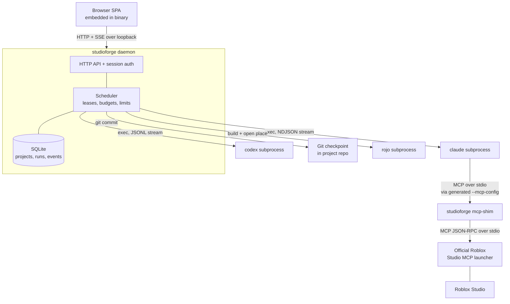

# StudioForge

[](#project-status)
[](LICENSE)
[](go.mod)

**An open-source development workflow that helps Claude Code build, understand, test, and maintain Roblox projects.**

> [!WARNING]
> This project is in active alpha development. APIs, configuration formats, installation steps, and internal architecture may change between releases.

[Русская версия](README.ru.md)

---

## What it does

StudioForge is a local Go daemon with an embedded browser interface. It sits between your Roblox project and the AI coding tools you already use, and it manages the parts of the work that happen *around* a single AI request:

- Registers Roblox projects and keeps each one's state, agents, runs, and event history separate.
- Starts and supervises Claude Code (and Codex CLI) as subprocesses, streaming their output as persisted, replayable events.
- Schedules runs with per-project write leases, concurrency limits, and spend ceilings, so concurrent work on one project cannot collide.
- Grants Roblox Studio access to a run through Roblox's **official** Studio MCP launcher, with a tool allowlist scoped to the agent's permission profile.
- Commits a Git checkpoint before each non-plan Claude run, so any change an agent makes can be reviewed and reverted.
- Builds and opens a Rojo place in Studio.
- Reports what it detected on your machine — executables, versions, authentication state, database health — through `studioforge doctor`.

## Why it exists

General-purpose AI coding tools reason well about a folder of text files. Roblox development is not only that. It involves a proprietary editor, a Luau codebase, binary place files, external sync tooling such as Rojo, and a runtime you can only observe by playing the game.

The result is that the interesting problems are rarely "write this function". They are: *which* project is this, what has already been decided, which agent is allowed to touch the open place, what changed on disk, and how do I undo it. StudioForge is an attempt to hold that context in one place and make those runs repeatable.

## Relationship to Roblox's official MCP tooling

Roblox's official MCP tooling provides access to Roblox Studio operations. **StudioForge does not replace it and does not reimplement it.**

This repository contains no Roblox Studio plugin. Instead, StudioForge detects Roblox's own official Studio MCP launcher on your machine, speaks the real MCP JSON-RPC protocol to it over stdio, and adds a project-level layer around it:

| Provided by Roblox's official MCP tooling | Added by StudioForge |
| --- | --- |
| The Studio operations themselves | Per-run MCP configuration generated for each agent |
| The launcher and its tool surface | A tool allowlist scoped by the agent's permission profile |
| Studio-side execution | Fail-closed access rules, run scheduling, budgets, and leases |
| — | Project registry, persisted event history, Git checkpoints |

StudioForge also ships an MCP stdio shim (`studioforge mcp-shim`) so an agent keeps a usable tool list even when another client already holds the launcher's single WS-host slot.

The value StudioForge aims to add is in context, orchestration, validation, repeatability, and integration between tools — not in Studio access itself.

## Feature status

The project is an alpha as a whole. The table below describes individual capabilities.

### Implemented — works and is covered by tests

| Capability | Notes |
| --- | --- |
| Local daemon + embedded SPA | Loopback bind, one-use bootstrap token, HttpOnly SameSite cookie |
| Multi-project registry | Canonical project roots, path containment, symlink rejection |
| SQLite storage | Pure-Go driver (no CGO), embedded migrations, WAL, integrity checks, backups |
| Run scheduler | Fair queue, writer leases, per-project/provider/model limits, budgets, pause/resume/cancel/restart, interrupted-run recovery |
| Persisted events + live stream | Server-sent events at `/api/v1/events` |
| Claude Code provider | Real `claude` subprocess, runtime flag discovery, NDJSON streaming, session resume, classified failures |
| Codex CLI provider | `codex exec --json`, JSONL events, workspace sandbox, thread resume |
| Orchestrator delegation | Agents with an orchestrator role pass other enabled agents to Claude's native `--agents` flag |
| Official Studio MCP integration | Launcher discovery, per-run config, permission-scoped tool allowlist, JSON-RPC stdio transport, `mcp-shim` |
| Studio MCP tool guidance | The standing system prompt steers agents toward Studio's own tools — `generate_mesh`/`generate_material`/`generate_procedural_model`, `search_asset` + `insert_asset`, `wait_job_finished`, `subagent`/`skill` delegation, `screen_capture`/console/playtest checks — over hand-written Luau |
| Interactive questions | An agent can pause a run on a closed 2-4 option question (a `studioforge-question` fenced block); the chat view renders clickable option buttons and answering resumes the same session |
| Git checkpoints | Auto-commit before each non-plan Claude run |
| Rojo build + open | Compiles a place file and opens it in Studio |
| Rojo live-sync | `POST`/`DELETE /api/v1/projects/{id}/sync` start and stop a `rojo serve` session that pushes on-disk edits into an already-open Studio; the project Overview shows whether a session is running, its port, and its most recent log lines |
| Static project context | Reads `.agent/constitution.yaml` and `.agent/requirements.md` verbatim into the system prompt |
| Image attachments | Paste a screenshot into the chat composer; it uploads and is folded into the prompt as a file path the agent can read |
| Run pace indicator | `GET /api/v1/projects/{id}/pace` averages a project's last ~20 completed runs into a typical duration; the chat progress bar scales against it |
| Diagnostics | `studioforge doctor`, redacted `--bundle` archive, unit-tested |
| Deterministic demo | `--mock` runs three seeded projects with no Claude, Studio, or Rojo |
| Packaging | Windows amd64 zip, macOS arm64 `.app` (both unsigned development builds) |
| Per-run diff | `GET /api/v1/runs/{id}/diff` shows the working tree's diff against the pre-run checkpoint commit in a chat panel; empty (not an error) for a project with no Git repo |
| Task dependencies | Task creation accepts a `dependencies` field, validated as a DAG (a cycle is rejected); not yet enforced at run time — a task can still be run before its dependencies finish |
| Project memory | Each completed run leaves a short memory entry (its own prompt); the next run in that project sees up to five relevant past entries in its system prompt |
| Playtest validation loop | Opt-in per agent (`validateAfterRun`, off by default): after a non-plan Claude run with `workspace-write`+ permission and a real Studio grant, the daemon opens its own Studio MCP connection, enters Play mode, polls the console, takes a screenshot, exits Play mode, and classifies the result as passed/failed/inconclusive. A failed result schedules up to `maxCorrectionRuns` follow-up runs (default 1) through the normal scheduler, resuming the same session with the failure detail in the prompt |
| Real Studio session discovery | The Studio Sessions view's **Refresh** button (`POST /api/v1/studio/sessions/refresh`) runs a live launcher probe, lists every open Roblox Studio instance (no single-instance refusal — this is a read-only listing, not an access grant), auto-binds an unambiguous match to a registered project by expected place name, and never overrides an existing manual **Bind project** choice on a later refresh |

### Experimental — implemented, but not verified against real external software by default

| Capability | Why it is experimental |
| --- | --- |
| Studio access grant | Fail-closed: granted only when exactly one Studio instance is open; the chat badge also reports a distinct blocked state (Studio open, connection held by another MCP client) separately from closed (see [Known limitations](#known-limitations)) |
| Permission-profile tool tiers | `read-only`, `workspace-write`, and `danger-full-access` gates are implemented and unit-tested |
| End-to-end Claude and Studio paths | Covered only by opt-in smoke tests behind `STUDIOFORGE_REAL_CLAUDE=1` / `STUDIOFORGE_REAL_STUDIO=1`; default tests and CI use fake CLIs |

### Present in code, but not reachable from the running product

These packages are implemented and unit-tested but have no caller in the API or app layer. They are listed here rather than advertised as features, and wiring or removing them is the first roadmap item.

| Package | State |
| --- | --- |
| `internal/gitops` — `Status`, `SafeRollback`, `Tag` | Exposed by no endpoint. `DiffHead` is wired (see the feature table above); the other three are not. |

### Planned — not implemented

Visual feedback and screenshot-driven iteration beyond the validation loop's own single screenshot · autonomous backlog-driven loops · project context beyond the two static files.

### Not supported

No Roblox Studio plugin ships here · no direct Studio control without the official launcher · no marketplace or asset automation · no remote, hosted, or multi-user access.

## Architecture



See [docs/ARCHITECTURE.md](docs/ARCHITECTURE.md) for components, protocols, data flow, trust boundaries, and extension points.

## Requirements

| To do this | You need |
| --- | --- |
| Run a packaged build | Windows 10+ (amd64) or macOS (Apple Silicon). No Go or Node.js at runtime. |
| Build from source | Go 1.25.12 or newer, Node.js 22 or newer, npm, Git |
| Use Claude Code runs | Claude Code installed and authenticated (StudioForge stores no Anthropic token) |
| Use Codex runs | Codex CLI installed with saved CLI authentication |
| Use Roblox Studio access | Roblox Studio with its official MCP launcher, on Windows or macOS |
| Use Rojo | Rojo 7 |

Everything except Go, Node.js, npm, and Git is optional. StudioForge runs without Claude, Studio, or Rojo — see the `--mock` demo below.

## Quick start

From source, on Windows PowerShell:

```powershell
git clone https://github.com/10kkyvl/studioforge.git
Set-Location studioforge
./scripts/dev.ps1 --no-open
```

On macOS or Linux:

```sh
git clone https://github.com/10kkyvl/studioforge.git
cd studioforge
./scripts/dev.sh --no-open
```

The command prints `STUDIOFORGE_URL` and a one-use bootstrap token. Omit `--no-open` to open the authenticated page automatically.

To see the interface with no external tools installed at all:

```sh
./scripts/dev.sh --mock --no-open
```

The `--mock` demo seeds three projects. Its Studio Sessions rows are demo data, not live state — a real install discovers actual open Studio instances instead, via the Studio Sessions view's **Refresh** action; task dependencies can also be created for real on any project now (see Feature status).

## Installation

Build a release package:

```powershell
./scripts/package.ps1
Expand-Archive ./artifacts/StudioForge-<version>-windows-amd64.zip ./StudioForge
./StudioForge/studioforge.exe --mock
```

On macOS, extract the arm64 archive and open `StudioForge.app`. Packages are unsigned development builds; macOS may require a one-time Control-click → **Open**. Do not disable Gatekeeper globally.

Full instructions, including Studio and Rojo setup, are in [docs/GETTING_STARTED.md](docs/GETTING_STARTED.md).

## Configuration

```text
studioforge [--port N] [--host LOOPBACK] [--data-dir PATH] [--no-open]
            [--log-level debug|info|warn|error] [--safe-mode] [--mock]
studioforge doctor [--data-dir PATH] [--bundle diagnostics.zip]
studioforge export --project ID --output project.zip
studioforge import --file project.zip [--apply --path EXISTING_ROOT]
studioforge --version
```

Runtime data is stored in the OS user configuration directory unless `--data-dir` is set. Executable paths for Claude, Codex, Rojo, Git, and the Studio MCP launcher can be overridden from the Settings page without restarting.

Non-loopback binding is refused unless `--unsafe-host` is supplied explicitly. StudioForge has no remote authentication of any kind; do not expose it to an untrusted network.

## Example workflow

Register a project, optionally add context files, and send one instruction:

```yaml
# <project>/.agent/constitution.yaml
principles:
  - Server authority for all currency changes.
  - No third-party assets without a recorded review.
```

```markdown
<!-- <project>/.agent/requirements.md -->
Round-based obby. Checkpoints persist per player across a session.
```

Both files are read verbatim and prepended to the system prompt. They are the only context files StudioForge reads today.

Send an instruction in the chat view; the run is admitted by the scheduler, a Git checkpoint is committed, the provider subprocess starts, and events stream into the UI. Inspect the result with `git log` and `git diff` in your own repository.

A step-by-step version, including a no-dependency track, is in [docs/EXAMPLE_WORKFLOW.md](docs/EXAMPLE_WORKFLOW.md).

## Demo

No recorded demo exists yet. [docs/DEMO_SCRIPT.md](docs/DEMO_SCRIPT.md) contains the recording script for one, along with the screenshot list this README will use. The screenshots under `docs/screenshots/` show the real interface populated with the built-in demo data.

## Known limitations

The most important ones for a new user:

- **Studio access is granted only when exactly one Studio instance is open.** Claude Code runs its own MCP client and `set_active_studio` is per-connection state, so StudioForge cannot pin an instance on the agent's connection from outside, and the launcher takes no instance-selection argument. With several Studios open, access is refused rather than guessed, and the run continues without Studio.
- **Studio access applies to Claude runs only.** The Codex adapter has no `--mcp-config` equivalent.
- **A Claude run inherits your own Claude Code configuration** — `CLAUDE.md`, hooks, plugins, and skills — which is billed to every run and makes behaviour depend on your local install.
- **`--max-turns` is not enforced.** The flag does not exist in current Claude Code, so only budget ceilings bound a run.
- **The playtest validation loop classifies the console heuristically** (script-error and infinite-yield phrase matching), not by parsing a documented Studio MCP schema, and it only ever runs when an agent opted in and the run reached Studio — like Studio access itself, an absent or ambiguous Studio makes it silently `inconclusive` rather than failing the run.
- **Real Studio session discovery is manual, not automatic.** The Studio Sessions view refreshes only on request (its **Refresh** button); nothing polls the launcher in the background, to avoid spawning it and competing with a running agent for Studio's single WS host slot. Under `--mock`, refresh is a no-op and the view always shows the seeded demo rows.
- **Several packages are not wired in** — see the feature status table above.
- **Packages are unsigned** on both Windows and macOS.

The complete list is in [docs/KNOWN_LIMITATIONS.md](docs/KNOWN_LIMITATIONS.md).

## Security considerations

StudioForge binds to loopback, issues a one-use bootstrap token exchanged for an HttpOnly SameSite cookie, validates Host and Origin on mutating requests, sets no CORS headers at all, canonicalizes project roots at registration, passes a reduced environment to provider subprocesses, and redacts known credential formats from diagnostic bundles.

Two details worth knowing precisely: redaction currently runs on diagnostic bundles only, not on application logs or stored run transcripts; and the per-request path traversal and symlink-escape check exists but is unused, because no endpoint accepts a project-relative path today.

Localhost is not a trust boundary. An agent running with a permissive profile can change your project files; the Git checkpoint is a recovery mechanism, not a preventative control. StudioForge stores no Anthropic token — Claude Code owns its own authentication.

See [docs/SECURITY.md](docs/SECURITY.md) for the full model and [SECURITY.md](SECURITY.md) to report a vulnerability.

## Roadmap

Near-term work is stabilization: gating run execution on task-dependency readiness (dependencies are persisted and validated today but not yet enforced) and adding automatic pruning for persisted run events. See [docs/ROADMAP.md](docs/ROADMAP.md).

## Contributing

Issues and pull requests are welcome. Please open an issue before large behavior or schema changes. See [CONTRIBUTING.md](CONTRIBUTING.md) for setup, style, testing expectations, and the rules for adding a provider adapter or a new Studio tool.

## Documentation

| Document | Contents |
| --- | --- |
| [Getting started](docs/GETTING_STARTED.md) | Prerequisites, installation, first workflow, uninstall |
| [Integration guide](docs/en/README.md) · [Русский](docs/ru/README.md) | Per-integration detail: Codex CLI, Claude Code, Studio MCP, Rojo |
| [Architecture](docs/ARCHITECTURE.md) | Components, protocols, data flow, trust boundaries |
| [Development](docs/DEVELOPMENT.md) | Local setup, commands, tests, adding integrations |
| [Example workflow](docs/EXAMPLE_WORKFLOW.md) | Reproducible worked example |
| [Troubleshooting](docs/TROUBLESHOOTING.md) | Common failures and fixes |
| [Security model](docs/SECURITY.md) | Access, trust assumptions, safe usage |
| [Known limitations](docs/KNOWN_LIMITATIONS.md) | Complete list |
| [Roadmap](docs/ROADMAP.md) | Alpha stabilization, near-term, exploration |
| [Testing](docs/TESTING.md) | Automated suites and the manual verification checklist |
| [API reference](docs/API.md) · [OpenAPI](docs/api/openapi.yaml) | HTTP endpoints |
| [Database](docs/DATABASE.md) | Schema and migrations |
| [Release process](docs/RELEASE_PROCESS.md) | Versioning, checklist, tagging |
| [Changelog](CHANGELOG.md) | Release history |

## License

MIT — see [LICENSE](LICENSE).

## Project status

Newly released public alpha. There is no prior public release and no stable interface. Expect breaking changes between alpha versions, and read [Known limitations](#known-limitations) before relying on any part of it.
