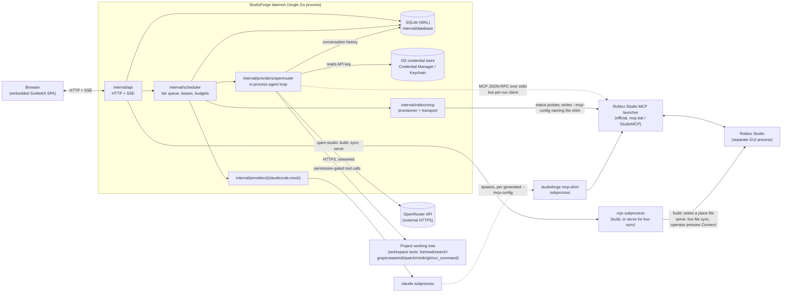

# Architecture

StudioForge is a public alpha with no prior release and no git tags. This document describes what the
code in this repository actually does, not a target state.

## Overview

StudioForge is a single Go daemon (`cmd/studioforge` → `internal/app`) that embeds a compiled SvelteKit
SPA, stores its state in a local SQLite database, and drives external developer tools — `claude`,
Roblox's official Studio MCP launcher, and `rojo` — as supervised subprocesses. A second agent
provider, OpenRouter, is not a subprocess at all: it is an HTTP API that StudioForge drives with its
own in-process bounded tool loop (`internal/providers/openrouter`). There is no second runtime
service, no remote component, and no Roblox Studio plugin in this repository.

The central idea is that StudioForge is a **project-level workflow layer**, not a replacement for any of
the tools it orchestrates. It does not reimplement Claude Code, Rojo, or Roblox Studio's MCP
integration, and for OpenRouter it does not reimplement the model itself — only the loop that turns a
prompt into tool calls against the local workspace and Roblox Studio. Instead it registers a project,
keeps per-project state (agents, tasks, runs, event history) separate from every other project,
schedules and rate-limits work against that state, and either starts an external tool as a child
process and streams its output back to the browser (Claude, Rojo) or drives an HTTP API directly and
streams its own loop's output the same way (OpenRouter). The value it adds is in context, scheduling,
budgets, checkpoints, and access control around calls to tools and models it does not own.

The Codex CLI provider that once filled this second-provider role has been removed from the codebase
entirely — no package, no subprocess, no discovery, no settings field. Runs saved earlier with
`provider="codex"` remain in SQLite unmodified and readable through the normal run API; they are
flagged in the UI as legacy and cannot be restarted or resumed (see "Failure handling" and
`internal/api/legacy_codex_test.go`).

## Component map

Grouped by what each package is responsible for. All packages compile into one binary; there is no
plugin loading or dynamic linking.

### Entry point and daemon

- `cmd/studioforge` — flag parsing and subcommand dispatch: the default daemon command, `doctor`,
  `export`, `import`, and `mcp-shim`.
- `internal/app` — daemon startup and shutdown: resolves the data directory, acquires the single-instance
  lock, opens the database, recovers interrupted runs, optionally seeds the `--mock` demo, wires the
  scheduler, provider adapters, the Studio MCP provisioner, and the HTTP server, then owns shutdown
  ordering.
- `internal/config` — `Options` (host/port/data-dir/log-level/safe-mode/mock/unsafe-host), loopback host
  validation, and the `Version`/`Commit`/`BuildDate` variables injected via `-ldflags` at build time.

### HTTP and events

- `internal/api` — the HTTP handler tree, security middleware (Host/Origin/session checks, security
  headers), the run-creation path, and the embedded-SPA static file server.
- `internal/events` — `Hub`, an in-process publish/subscribe fan-out over already-persisted run events.
- `internal/webui` — `//go:embed all:dist` of the built SvelteKit output; no Node.js is required at
  runtime.

### Scheduling and resources

- `internal/scheduler` — a fair per-project queue (`fairqueue.go`), the run lifecycle state machine
  (`state.go`), and `Manager` (`scheduler.go`), which enforces global/per-project/per-provider/per-model
  concurrency limits, checks budgets before starting a job, calls an installable `MCPProvisioner` hook,
  and supports pause/resume/cancel/restart plus heartbeat-based interrupted-run detection. Pause is a
  controlled cancel, not a live-process suspend: it stops the provider process the same safe way
  `Cancel` does, records usage and the provider session, and releases the write lease before the store
  is ever told `paused`; `POST /api/v1/runs/{id}/resume` then submits a fresh continuation run against
  that saved session rather than un-parking a still-live process, so a `paused` row survives a daemon
  restart and stays resumable. SQLite is the single source of truth for a run's lifecycle state:
  `scheduler.transition` returns its store-write error to the caller instead of swallowing it, and
  `Manager.run` publishes a run's status event only after that write succeeds — a failed write instead
  publishes a distinct `scheduler.storage_error` event and leaves the row at its last persisted status,
  for `RecoverInterrupted` to pick up as `interrupted` on the next restart. A second
  installable hook, `MCPValidator`, runs after a qualifying Claude run completes: `Manager.run`
  calls it, persists the resulting `passed`/`failed`/`inconclusive` outcome on the run, publishes it as
  a normal run event, and on `failed` schedules a follow-up correction run through the same `Submit`
  path (writer lease, budget check, and its own Git checkpoint all apply) — see "The self-correcting
  playtest validation loop" below. Validation runs under its own cancellable context and aborts to
  `inconclusive` — never `passed` — the instant the run's write lease is lost, scheduling no correction
  and proposing no decision. A correction run's Git checkpoint is bound to its own, already-created run
  id before that run is admitted to the executable queue, so a failed admission never leaves an
  orphaned checkpoint, and correction scheduling is idempotent, keyed on the parent run id. A third
  installable hook, `DecisionProposer`, is called only when a
  failed validation's correction budget is exhausted (`CorrectionDepth >= MaxCorrectionRuns`): rather
  than only marking the lineage `correction_failed` (which still happens unconditionally), it hands the
  proposed follow-up correction `Job` to whatever persists it as a pending `Decision` — see "Operator
  decisions" below. A `nil` proposer (the default until one is installed) leaves this exactly as before
  Priority 4: no decision, just the correction_failed mark.
- `internal/resources` — `Manager`, an atomic lease table keyed by sorted resource-key lists, with TTL
  expiry, heartbeat renewal, and idempotent release. The scheduler uses one lease key,
  `project:<id>:write`, per run, which is what makes "one writer per project" hold.

### Storage

- `internal/database` — SQLite connection setup (WAL, busy timeout, foreign keys), migration
  application, integrity checks, backup (`VACUUM INTO`), and `Store`, the query layer for projects,
  agents, tasks, runs, run events, threads, settings, and Studio session bindings.
- `internal/migrations` — embedded, ordered, immutable `.sql` migration files (`//go:embed sql/*.sql`).
- `internal/models` — the shared DTOs (`Project`, `Agent`, `Task`, `Run`, `RunEvent`, `ChatThread`,
  `StudioSession`, `Diagnostics`, …) used across the database, API, and scheduler layers.

### Providers (AI coding tools)

- `internal/providers` — the `Provider` interface (`Diagnose`, `Start`, `Resume`, `Cancel`) and the
  shared `RunRequest`/`Event`/`Result`/`Subagent` types every adapter implements against.
- `internal/providers/claudecode` — execs the real `claude` binary in `-p` (non-interactive) mode,
  discovers which flags it supports by parsing `claude --help`, builds arguments accordingly, streams and
  classifies `stream-json` NDJSON events, and supports session resume and orchestrator subagent
  delegation via `--agents`.
- `internal/providers/openrouter` — a fundamentally different shape from the two CLI adapters: no
  subprocess is exec'd. `agentloop.go` runs a bounded loop that calls OpenRouter's chat-completions
  endpoint over HTTPS, streams the response, and executes whichever tool calls the model requests
  against two tool sources — `agenttools` (local workspace list/read/search/grep/create/edit/patch/
  mkdir/git/run_command, gated by the run's read-only / workspace-write / danger-full-access profile)
  and `mcpbridge` (a live per-run Roblox Studio MCP client, wrapped to enforce the same
  permission-profile tool allowlist fail-closed). `credential` manages the OpenRouter API key through
  `internal/platform.SecretStore` with an env/session fallback; `catalog` fetches and caches the
  OpenRouter model list and curated recommendations; `conversation.go` persists and replays per-thread
  chat history; `images.go` resolves and encodes image attachments for vision-capable models; `orclient`
  is the thin OpenRouter HTTP client itself.
- `internal/providers/mock` — a deterministic adapter used by the `--mock` demo and by tests; it needs no
  external binary.

### Roblox Studio integration

- `internal/roblox/mcp` — `config.go` (launcher discovery, the tool allowlist by permission profile,
  writing a per-run MCP config file), `transport.go` (a from-scratch MCP JSON-RPC stdio client),
  `client.go` (`Discover`/`Call`/`ListStudios`/`SelectStudio` on top of the transport), `provisioner.go`
  (the fail-closed access-grant decision described below), and `shim.go` (the `studioforge mcp-shim`
  server).
- `internal/roblox/studio` — `studio.go`: `Opener.OpenProject` builds a project's Rojo place file and
  launches Roblox Studio on it; `PlaceName` derives the place's file name from the project name and ID,
  which is how an already-open Studio window is later recognized as belonging to a given project.

### Rojo

- `internal/rojo` — `Manager.Build` and `Manager.InstallPlugin` compile a `.project.json` into a place
  file and install the Rojo Studio plugin; both are called by `studio.Opener.OpenProject`. `Manager.Start`/
  `Stop`/`Session` run and track a `rojo serve` live-sync session under `internal/processes.Supervisor`, one
  per project, on an allocated loopback port; `internal/app` adapts them to `api.Syncer`
  (`internal/app/sync.go`), and `POST`/`DELETE /api/v1/projects/{id}/sync` are the endpoints that actually
  start and stop one — this is what delivers a `.lua` file the agent just edited on disk into an
  already-open Studio without restarting it. A session outlives the run that started it; it is torn down by
  `processes.Supervisor.Close` on daemon shutdown, the same path every other subprocess in this document's
  process table stops through. `Session.RecentLines` keeps a bounded, thread-safe buffer (the last 100
  lines) of the session's own `rojo serve` output, fed by the same goroutine that already drained the
  session's log channel for debug logging; `syncAdapter.Status`/`Start` fold it into `models.SyncStatus`,
  which rides on the project payload the same way port and active state already do, so the project
  Overview can show it without a dedicated polling endpoint.

### Git

- `internal/gitcheckpoint` — `Checkpoint(root, label)` returns the new commit hash and the branch it
  landed on, a best-effort `git add -A && git commit` run before every non-plan Claude run
  (`internal/api/api.go`'s `createRun`) and before every scheduled correction run
  (`internal/scheduler/scheduler.go`'s `scheduleCorrection`). Both callers persist the result as a
  `checkpoints` row (`database.Store.CreateCheckpoint`) once the run they precede actually exists, so a
  run can be linked back to the exact commit taken before it started
  (`database.Store.CheckpointForRun`); a non-git project or an empty diff yields no checkpoint row,
  which is the normal case, not an error.
- `internal/gitops` — `Client.DiffHead(ctx, root)` and `DiffCommit(ctx, root, commit)` run `git diff
  HEAD` and `git diff <commit>` respectively (returning an empty diff, not an error, when `root` isn't a
  Git repo), `Status`, `SafeRollback` (creates and switches to a new
  `studioforge/rollback-<UTC timestamp>` branch — the original branch is never touched, reset, or
  force-pushed), and `Tag` are all wired through a `GitOps` interface declared in `internal/api` and a
  thin adapter over `gitops.New()` built in `internal/app`. `GET /api/v1/runs/{id}/diff`
  (`internal/api/diff.go`) uses `CheckpointForRun` to diff against that run's own checkpoint commit when
  one exists, falling back to `DiffHead` otherwise; `GET /api/v1/projects/{id}/git/status`,
  `POST /api/v1/runs/{id}/rollback`, and `POST /api/v1/projects/{id}/git/tag` are the remaining
  endpoints, all in `internal/api/git.go`. Rollback also refuses (409) while the project's write lease
  is held by another run — a best-effort, check-then-act guard against a `SafeRollback` racing a run
  still writing to the same project.

### Project state and prompts

- `internal/projects` — `PathGuard` (canonical-path registration and containment, used to reject any
  resolved path outside a registered project root), `Fingerprint`, `Scaffold` (writes a new project's
  Rojo skeleton), and `LoadContext`, which reads exactly two files verbatim —
  `.agent/constitution.yaml` and `.agent/requirements.md` — for inclusion in the system prompt.
- `internal/memory` — a SQLite FTS5-backed store (`Put`/`Search`, with a `LIKE` fallback when FTS5 is
  unavailable), wired minimally: `internal/scheduler.Manager` writes one `Entry` per run (its own
  prompt, truncated) on the sole `running → completed` transition, and `internal/api.createRun`
  searches it (limit 5) before assembling the system prompt. Both sides are behind a `Memory`
  interface declared in `internal/api`, keeping `internal/api` free of a direct import of
  `internal/memory`'s concrete `*Store`.
- `internal/prompts` — `HouseRules` and `ForRun` (in `houserules.go`) build the system prompt every
  run actually receives: the standing house rules, the project's static `.agent/*` context, the
  agent's own stored system prompt, and now a "Relevant project memory" block when
  `internal/memory.Store.Search` returns results for the project (see the memory bullet in the
  component map below). The earlier structured, multi-section `Assemble`/`Input` template (with its
  own memory/blackboard/playtest/review sections) was deleted along with its dead
  `DecisionRequest`/`PlaytestResult`/`ReviewResult` result types — it never had a caller outside its
  own test.

### Cross-cutting

- `internal/security` — `Redact`, a regex-based secret scrubber for API keys, bearer tokens, and PEM
  private key blocks, applied to diagnostic bundle exports.
- `internal/diagnostics` — `Doctor.Run` (dependency and database checks surfaced by `studioforge doctor`
  and `GET /api/v1/diagnostics`) and `Doctor.ExportBundle` (a redacted diagnostic zip). This package has
  no test files.
- `internal/processes` — `Supervisor` (tracked, terminable child processes; used for Rojo serve sessions)
  and `MinimalEnvironment`, the allowlist that reduces what environment variables a provider subprocess
  inherits. `Supervisor.Start` reserves a process ID atomically before launching the (slower, unlocked)
  child, and its reaper deletes a map entry only when that entry still refers to the same process
  instance — closing a race where two concurrent `Start` calls for the same ID could both launch a
  child and clobber each other's map entry.
- `internal/platform` — data-directory resolution, the single-instance lock file, browser launching, a
  `SecretStore` interface backed by real adapters — Windows Credential Manager
  (`secretstore_windows.go`, via `CredWriteW`/`CredReadW`/`CredDeleteW`) and macOS Keychain
  (`secretstore_darwin.go`, via the `security` CLI) — used to store the OpenRouter API key
  (`ErrSecretStoreUnavailable` triggers the credential manager's session-only fallback on a platform or
  environment without a working store; StudioForge still does not store an Anthropic token, since
  Claude Code owns its own authentication), and `toolpath`, which probes PATH and known install
  locations for each external tool.
- `internal/portable` — `Export`/`Inspect`/`Apply` for the `studioforge export`/`import` CLI commands.

## Process boundaries

| Process | Started by | Lifetime | Talks to |
| --- | --- | --- | --- |
| StudioForge daemon | the user (`studioforge`, or `studioforge --mock`) | until stopped or the terminal closes | SQLite file, all subprocesses below, the browser over HTTP |
| Browser | opened automatically (or manually) against the daemon's loopback URL | until closed | the daemon, over HTTP + SSE only |
| `claude` | the daemon, per run | one run (`-p` exits when the turn completes) | stdout/stderr NDJSON to the daemon; optionally the `mcp-shim` subprocess over stdio, per its generated `--mcp-config` |
| OpenRouter agent loop | in-process, inside the daemon, per run — not a subprocess | one run (the loop returns when the turn/tool sequence completes) | HTTPS to `openrouter.ai`; JSON-RPC over stdio directly to the Studio MCP launcher when Studio access is granted |
| Roblox Studio MCP launcher (`mcp.bat` / `StudioMCP`) | the daemon (via provisioning/status probes), the `mcp-shim` subprocess, or the OpenRouter loop's own MCP client | per probe, or for the shim's/loop's lifetime | Roblox Studio's own WebSocket host inside the Studio process; JSON-RPC over stdio to whichever process spawned it |
| `studioforge mcp-shim` | `claude`, as the command in its generated `--mcp-config` | for the run's duration | the Studio MCP launcher over stdio (lazily, on first request); the `claude` process over stdio |
| `rojo build` | the daemon, when opening a project in Studio | one build (exits when done) | stdout/stderr captured by the daemon |
| `rojo serve` | the daemon, on `POST /api/v1/projects/{id}/sync` | until `DELETE /api/v1/projects/{id}/sync`, or daemon shutdown | stdout/stderr captured by the daemon as log lines; Studio talks to it over its own loopback port, not through the daemon |

Roblox Studio itself is a separate, independently launched GUI application. StudioForge does not manage
its process lifecycle — it only launches it once (`studio.LaunchPlace`, detached from the request that
triggered it) and talks to its MCP launcher.

## Communication protocols

- **Browser ↔ daemon** — HTTP for commands (`/api/v1/...`) and Server-Sent Events for the live run-event
  stream (`GET /api/v1/events`). There is no WebSocket in this repository.
- **Daemon ↔ `claude`** — the daemon execs the CLI with constructed arguments and a reduced
  environment (`processes.MinimalEnvironment`), then reads newline-delimited `stream-json` events from
  its stdout, parsed line-by-line and normalized into the shared `providers.Event` shape before being
  persisted and re-published.
- **Daemon ↔ OpenRouter** — no subprocess and no NDJSON parsing: `internal/providers/openrouter`'s
  in-process loop calls OpenRouter's chat-completions endpoint directly over HTTPS with the operator's
  API key, streams the response, and normalizes it into the same `providers.Event` shape as the CLI
  adapters, so the rest of the daemon (persistence, SSE, budgets) cannot tell the difference between a
  Claude event and an OpenRouter one once it reaches that shape.
- **Daemon/shim ↔ Roblox Studio MCP launcher** — real MCP JSON-RPC 2.0 over stdio
  (`internal/roblox/mcp/transport.go`): an `initialize` handshake, `tools/list`, and `tools/call`,
  multiplexed by numeric request ID over one child process's stdin/stdout. Claude reaches it through the
  `mcp-shim` subprocess; OpenRouter's in-process loop opens its own client directly against the same
  transport, wrapped by `mcpbridge`.
- **Per-run MCP config** — when a Claude run is granted Studio access, the provisioner writes a small JSON
  file (`{"mcpServers": {"Roblox_Studio": {"command": ..., "args": [...]}}}`) to
  `<data-dir>/mcp/<run-id>.json` and passes its path to `claude --mcp-config`; the file is removed when
  the run's grant is released. An OpenRouter run has no such file — the provisioner hands its loop a
  live client handle (`grant.Client`) directly instead of a config path, since there is no subprocess to
  pass a flag to.

## Roblox Studio integration

This repository contains **no Roblox Studio plugin** and does not reimplement any Studio operation.
What it does is detect and launch Roblox's own official Studio MCP launcher and add a project-level
layer of policy around it.

**Launcher discovery** (`mcp.DetectLauncher`): with no configured override, it looks for
`%LOCALAPPDATA%\Roblox\mcp.bat` on Windows (invoked as `cmd.exe /c mcp.bat`, since it is a batch file) or
`/Applications/RobloxStudio.app/Contents/MacOS/StudioMCP` on macOS. Other platforms are reported as
unsupported. An operator-configured `studio_mcp_path` override takes precedence and is stat-checked
before use.

**Tool allowlist by permission profile** (`mcp.AllowedTools`): in non-interactive mode, an MCP tool call
Claude has not been told to auto-approve is denied, so the allowlist is what actually grants access, not
just registration of the server. Three tiers, each including the tier below it:
`read-only` (`script_read`, `script_search`, `script_grep`, `search_game_tree`, `inspect_instance`,
`get_studio_state`, `get_console_output`, `screen_capture`, `list_roblox_studios`, `set_active_studio`);
`workspace-write` adds tools that change the open place (`multi_edit`, `execute_luau`, `generate_mesh`,
`generate_material`, `generate_procedural_model`, `insert_asset`, `search_asset`, `wait_job_finished`,
`start_stop_play`, `subagent`, `skill`, `character_navigation`); `danger-full-access` adds tools that
reach past the place (`upload_image`, `store_image`, `http_get`, `user_keyboard_input`,
`user_mouse_input`). An unrecognized profile grants nothing.

**Fail-closed single-instance rule**: Studio access is granted to a run only when the provisioner can
identify exactly one Studio instance to hand to it. The real technical cause: Claude Code runs its own
MCP client process, and `set_active_studio` is state on *that* connection, not something StudioForge can
set from outside on the agent's behalf, and the launcher accepts no instance-selection argument at
launch. With zero or several ambiguous instances open, `Provisioner.Provision` returns an empty grant (or
one with a `Notice` explaining why) rather than guessing, and the run proceeds without Studio access. When
a `Target.PlaceName` is known (i.e. a project is attached to the run) and no matching instance is open,
the provisioner can open one itself if `studio_auto_open` is enabled and — as of the fix below — **only
when no Studio instance is open at all**; one or more open instances that hold some other project's place
withhold with a `Notice` instead of auto-opening on top of them, naming what is actually open next to
what StudioForge expected (`mcp.mismatchNotice`), so a project's original/source `.rbxl` opened by hand
instead of its built `.studioforge/<name>.rbxl` place is easy to recognize from the notice alone.
`models.Project` does not currently record the source place file's own name or path anywhere, so matching
could not be loosened to also accept it without adding new schema — out of scope for this fix — and the
"never auto-open while anything is open" rule plus the diagnosable notice are the mitigation instead.

**Duplicate-launch guard**: `studio.Opener` (the type both the provisioner's auto-open, via
`Target.Open`, and the manual **Open Studio** button's handler funnel through — see
`internal/app/app.go`'s `studioOpener` and `studioTarget`/`Dependencies.Studio` wiring) now tracks its own
in-flight opens: `OpenProject` reserves the project's place name under a mutex before doing any work, and
a second call for the same place within a 90-second grace window (deliberately longer than the
provisioner's own 45-second `openWait`, since Studio can still be genuinely booting after a caller gives
up polling for it) returns the same place path without launching Studio again. A reservation that never
actually launched (a build or Studio-detection failure) is released immediately, so a fixed problem can be
retried right away rather than sitting out the rest of the window. The manual button additionally asks
`Provisioner.CheckOpen` — the read-only half of the same decision `selectForTarget` makes before
auto-opening, exposed via `Dependencies.StudioOpenCheck` in `internal/app/app.go` so `internal/api` does
not need to depend on `internal/roblox/mcp` for its shape — before ever calling `OpenProject`: an instance
already holding this project's place is reported as already open rather than relaunched, and other open
instances holding none of it refuse with the same notice text `selectForTarget` uses, all without
requesting an agent's MCP grant. A failed or unwired check fails open (falls through to `OpenProject`, and
so through its own in-flight guard) rather than blocking the button over a probe that could not run.

**Why the shim exists**: the launcher advertises its tool list only to whichever MCP client won its single
WebSocket host slot; every other client connected at the same time is told it has zero tools, even though
its tool *calls* still succeed through the host. Pointing an agent straight at the launcher therefore
risks the agent seeing no Studio tools at all whenever anything else (e.g. the Roblox Studio Assistant
itself) is also connected. `studioforge mcp-shim` sits between the agent and the launcher: it answers
`tools/list` from the best information available (a live connection, then a cached tool list from an
earlier successful connection, then a hardcoded fallback list with an open argument schema) and forwards
`tools/call` through untouched, so the agent's toolset stops depending on a race it cannot observe.

**Studio access applies to Claude and OpenRouter runs.** They reach it through two different
mechanisms that share the same underlying provisioner and fail-closed decision: Claude gets a
generated `--mcp-config` pointing at the shim; OpenRouter's in-process loop is handed a live client
directly (`grant.Client`, wrapped by `mcpbridge`) with no file or subprocess involved. Both are bound
by the identical permission-profile tool allowlist.

**The self-correcting playtest validation loop** (`mcp.Provisioner.Validate`, called through the
scheduler's `MCPValidator` hook) is a *second* Studio MCP connection the daemon opens itself, separate
from the one the agent's own run used (Claude's subprocess or OpenRouter's in-process client, both of
which have, by this point, already exited or finished their turn). It reuses `Provisioner`'s own
launcher discovery and instance-selection logic (`probe`/`selectForTarget`) to reach the same Studio
instance, then on one held-open transport: `start_stop_play` (enter Play mode), `screen_capture`
(once), polls `get_console_output` for a configurable window (`playtest_window_seconds`, default 30s),
`start_stop_play` again (exit Play mode), and classifies the collected console text. It only runs for a
job whose provider is Claude or OpenRouter (`scheduler.studioCapable`), non-plan, `workspace-write`
permission or above, opted in per-agent (`validate_after_run`), and actually holds a Studio grant for
that run — an absent, ambiguous, or unreachable Studio during validation resolves to `inconclusive`,
the same fail-open posture `Provision` itself takes. A `failed` outcome schedules a correction run (`parent_run_id`,
`correction_depth` on the `runs` table) that resumes the same CLI session with the console error lines
and the screenshot reference folded into its prompt; when that correction later resolves, its own
outcome is propagated one hop up (`corrected` or `correction_failed` on its direct parent), bounded by
the agent's `max_correction_runs`. The loop renews the project's write lease itself, on its own ticker
sized to a safe fraction of the lease manager's configured TTL (`resources.Manager.TTL`), because the
run's ordinary 5-second heartbeat loop stops draining once the provider process has already exited.

**Real Studio session discovery** (`mcp.Provisioner.ListSessions`, `POST /api/v1/studio/sessions/refresh`,
`internal/app/studiosessions.go`) is a third kind of daemon-initiated Studio MCP connection, on demand
rather than per-run: it lists every open instance via `list_roblox_studios`, then — unlike `Provision` and
`Validate` — deliberately does *not* refuse on more than one open instance, since showing every one of
them is the whole point of a listing rather than an access grant. For each instance it best-effort selects
it (`set_active_studio`) and reads `get_studio_state` to classify a play/edit state; a failure on one
instance leaves that instance's state unknown rather than dropping it from the list or failing the whole
pass. `internal/app.resolveSessionProjects` matches each discovered instance's reported name against every
registered project's expected place name (`studio.PlaceName`, the same rule `Provision`'s `Target` already
matches on); an unambiguous match auto-binds a brand-new instance to that project.
`database.Store.UpsertRealStudioSessions` then replaces the daemon's view of real (non-mock, `mock=0`)
sessions with the freshly discovered set — deleting any instance no longer open — while guaranteeing an
instance already bound to a project (whether by a previous auto-match or an operator's manual
**Bind project** action, `POST /api/v1/studios/{id}/bind`) keeps that binding regardless of what a later
pass resolves for it. Nothing polls the launcher in the background; every refresh is either the operator's
own click or a probe explicitly requested through the endpoint, because each one spawns a launcher process
that competes for Studio's single WS host slot. Under `--mock`, the refresh hook is never wired at all, so
the Studio Sessions view keeps showing only the seeded demo rows.

**Operator decisions** (`internal/database` migration `008_decisions.sql`, `models.Decision`,
`POST /api/v1/decisions/{id}/resolve`) are a fresh, narrowly-scoped replacement for the `decisions`
feature `006_drop_decisions.sql` removed — this one has an actual producer from day one, scoped to the
one case Priority 4 asked for. The scheduler's `DecisionProposer` hook fires only when a failed
validation's correction budget is exhausted; a job whose own permission profile is `read-only` never
reaches this point at all, because the validation loop itself never runs for a `read-only` job, and a
correction always inherits its parent's already-validated permission profile — so that half of the
originally described trigger is structurally unreachable, not merely untested. `internal/app.decisionProposer`
serializes the proposed correction `Job` verbatim (Go's `encoding/json` field-name mapping, no tags
needed, since both ends use the same `scheduler.Job` type) into `decisions.payload` alongside a summary
and detail (the console error lines), and persists it via `Store.CreateDecision` — `internal/database`
never interprets `payload`'s shape, only stores and returns it. `POST /api/v1/decisions/{id}/resolve`
with `{"approve": true}` deserializes it back into a `scheduler.Job` and submits it through the normal
`Manager.Submit` path (the same writer lease, budget ceiling, and Git checkpoint as any other run);
`{"approve": false}` schedules nothing — the run this decision was about was already marked
`correction_failed` when the decision was first proposed, unconditionally, regardless of whether a
proposer is even installed. Resolving an already-resolved or nonexistent decision is a 409/404, not a
silent success. Pending decisions ride on `GET /api/v1/snapshot` (`"decisions"`, filtered to `status=
pending`) the same way Studio sessions and studio-sync status already do, and are shown as an inline
banner (with Approve/Dismiss) on the Runs view, keyed by the decision's `runId`, rather than as a
separate nav section — a scope choice, since this alpha's only producer is 1:1 with a run's own
correction lineage.

## Data flow: one chat message, end to end

1. **HTTP request** — the browser posts to `POST /api/v1/runs` with a project, optional agent/task/thread
   ID, and the prompt text. `internal/api.Server.createRun` validates the project, resolves the task (if
   any) and prepends its title/description/acceptance criteria to the prompt, and resolves which enabled
   agent should run (explicit agent, else the project's configured lead agent, else the first enabled
   agent).
2. **Provider check** — `scheduler.Manager.Diagnose` runs the chosen provider's diagnostics (executable
   found, version, authentication) before a run is even queued; an unavailable or unauthenticated provider
   is rejected with a 409 immediately.
3. **Run record** — `scheduler.Manager.Submit` calls `database.Store.CreateRun`, which either creates a
   new `runs` row (status `queued`) or, if an `Idempotency-Key` header matches an existing run, returns
   that run unchanged. The job is pushed onto that project's slot in the fair queue.
4. **Scheduler admission** — the scheduler's loop pops jobs across projects in round-robin order, subject
   to global/per-project/per-provider/per-model concurrency ceilings (`canStartLocked`). Once popped, the
   run checks its project's budget (`Store.BudgetAllowed`) and then acquires a resource lease
   (`resources.Manager.Acquire`) on `project:<id>:write` — this is the "one writer per project" rule.
5. **Prompt assembly (as actually wired)** — before submission, `api.createRun` already built the system
   prompt via `prompts.ForRun`: the standing `prompts.HouseRules` (answer in the operator's language;
   the subject is the Roblox project, never StudioForge itself; prefer the Studio MCP tools over
   hand-written Luau; and the `studioforge-question` convention for asking a closed question), then the
   project's two static `.agent/*` context files (`projects.LoadContext`) if present, then a
   "Relevant project memory" block when `internal/memory.Store.Search` (limit 5, by project and the
   incoming prompt text) returns anything for this project, then the agent's stored `SystemPrompt`.
   Subagents forwarded to an orchestrator carry the same house rules. A memory-search failure is
   logged and non-fatal — the run proceeds without the block.
6. **Git checkpoint** — for Claude runs not in `plan` mode, `gitcheckpoint.Checkpoint` runs
   `git add -A && git commit` in the project root before the provider starts, so the operator has a
   revert point. This is best-effort: a non-git project or an empty diff is a silent no-op and never fails
   the run. Once the run itself is created, a successful checkpoint is persisted as a `checkpoints` row
   linking the run to its commit hash and branch (`database.Store.CreateCheckpoint`), so `GET
   /api/v1/runs/{id}/diff` and `POST /api/v1/runs/{id}/rollback` can later act on that exact commit.
7. **MCP provisioning** — if the run's provider is Claude or OpenRouter, the installed `MCPProvisioner`
   hook (`mcp.Provisioner.Provision`) runs the fail-closed Studio access check described above and, if
   granted, returns either a config path and allowed-tools list (Claude) or a live client handle and
   allowed-tools list (OpenRouter); a snapshot of the open place's state is also prepended to the prompt
   so the agent does not have to re-explore it.
8. **Provider start** — the scheduler calls `provider.Start` (or `.Resume`, if the thread has a prior
   session ID). For Claude this execs the `claude` binary with arguments built from the run request
   (model, effort, permission mode, MCP config path, allowed tools, subagents) and a minimized
   environment. For OpenRouter there is no exec at all: `agentloop.go` starts its in-process bounded
   loop directly, with the run's model, permission profile, MCP client (if granted), and — on resume —
   the thread's replayed conversation history.
9. **Streamed events** — the Claude adapter reads the subprocess's stdout line by line and classifies
   each line into a `providers.Event`; the OpenRouter loop classifies its own streamed HTTP response the
   same way. Either way, events land on a channel the scheduler drains identically.
10. **Persisted events** — the scheduler publishes each event through `events.Hub.Publish`, which first
    calls `Store.AppendEvents` (an INSERT that assigns a monotonically increasing `id`) and only then
    fans the now-persisted event out to subscribers. Events are never delivered live-only; every event a
    client can see also exists in SQLite.
11. **SSE to UI** — `GET /api/v1/events` first replays any events after the client's `Last-Event-ID` (or an
    `after` query parameter) from the database, then subscribes to the hub for new ones, sending a
    heartbeat comment every 15 seconds and disconnecting a client whose 256-event buffer overflows.

A note on the `status` event type: it is shared. The scheduler emits its own lifecycle changes under
raw type `scheduler.state` (and the initial queueing under `scheduler.queued`), but provider adapters
also classify their subprocess's `system`-class lines as `status` and pass that JSON through
unmodified as the payload. Sub-agents run inside the parent's process and so publish under the parent's
run ID, which means a payload like `{"subtype":"task_notification","status":"completed"}` describes a
sub-agent, not the run. Consumers deciding whether a run has ended must therefore key off the
`scheduler.state` raw type rather than the event type or a bare `status` field — see `endsRun` in
`web/src/lib/runStatus.ts`. `waiting_decision` — the status a run parks in when a completed assistant
message carries a `studioforge-question` fenced block (step 5 above) — ends the live stream the same
way: the run's process has already exited, even though the thread stays resumable and picks up the
same session once the operator answers.

## Configuration flow

- **CLI flags** (`cmd/studioforge/main.go`): `--host`, `--port`, `--data-dir`, `--no-open`,
  `--log-level`, `--safe-mode`, `--mock`, `--unsafe-host`, `--version`, plus the `doctor`, `export`,
  `import`, and `mcp-shim` subcommands.
- **Data directory resolution** (`platform.DataDir`): an explicit `--data-dir` is created and used as-is;
  otherwise it is `os.UserConfigDir()/StudioForge`. `EnsurePrivateDirs` creates `backups`, `exports`,
  `logs`, `artifacts`, `runtime`, and `mcp` subdirectories with `0o700` permissions.
- **Settings-page path overrides applied without restart**: `POST /api/v1/settings` persists a key/value
  to the `app_settings` table and, for a fixed set of keys (`claude_path`, `rojo_path`,
  `git_path`, `studio_mcp_path`, `studio_auto_open`, `concurrency`), calls an `applySetting` callback
  wired in `internal/app` that updates the live provider adapters, the Doctor's override fields, the
  Studio MCP override (an `atomic.Value`), the auto-open flag, or the scheduler's concurrency limits in
  place — no process restart is involved. OpenRouter has no path setting (it is not a CLI); its
  `POST /api/v1/openrouter/key` endpoint instead writes through `credential.Manager.Save`, which
  updates the live provider's key and the `openrouter_key_state` setting directly, also without a
  restart.
- **Version metadata**: `Version`, `Commit`, and `BuildDate` in `internal/config` default to
  `dev`/`none`/`unknown` and are overwritten at build time via `-ldflags -X ...` in `scripts/build.ps1` /
  `scripts/build.sh`, derived from `git describe` and `git rev-parse`.

## Storage and project state

- **Engine**: `modernc.org/sqlite` (pure Go, no CGO), opened with `journal_mode=WAL`,
  `synchronous=NORMAL`, `busy_timeout=5000`, and `foreign_keys=1` (`database.sqliteDSN`).
- **Migrations**: ordered, embedded `.sql` files applied once each, tracked in a `schema_migrations`
  ledger table; each migration runs inside its own transaction. New migrations are added rather than
  editing an already-released one.
- **FTS5 detection with `LIKE` fallback**: `database.enableFTS` attempts to create a `memory_fts` virtual
  table (`USING fts5(...)`); if that fails (the SQLite build lacks FTS5), `db.FTS5` is `false` and
  `internal/memory.Store.Search` falls back to a `LIKE '%...%'` query instead.
- **Integrity and backups**: `DB.Integrity` runs `PRAGMA integrity_check` and `PRAGMA foreign_key_check`;
  `DB.Backup` uses `VACUUM INTO` to a target path that must not already exist. `internal/app` runs an
  automatic backup at daemon start if the last one is more than 24 hours old, and `POST /api/v1/backups`
  triggers one on demand.
- **Portable export/import limits**: `studioforge export --project --output` (via `internal/portable`)
  writes a zip containing the project's metadata, its agents, and its tasks — explicitly *not* its
  source files (`Manifest.IncludesSource` is always `false`). `studioforge import --file` previews the
  manifest and, with `--apply`, requires an existing project root path; it does not recreate source from
  the archive.
- **Single-instance lock**: `platform.AcquireLock` writes a PID-stamped lock file in the data directory
  and refuses to start a second daemon against the same data directory while the recorded PID is alive.
- **OpenRouter conversation persistence**: `openrouter_messages` (FK'd to `chat_threads(id)` ON DELETE
  CASCADE) stores each turn of the OpenRouter provider's agent loop — user prompt, assistant message with
  its `tool_calls`, and each tool result — so the next run on a thread reloads and replays the history
  instead of starting over, and it survives a daemon restart. `internal/providers/openrouter.sanitizeHistory`
  makes a history saved by an interrupted run safe to replay, and `compactMessages` deterministically trims
  it once it grows past the provider's history budget. See `internal/providers/openrouter/conversation.go`
  and `internal/app/conversation.go` for the persistence seam and its database-backed adapter.
- **OpenRouter model catalog, images, and cost estimate**: `internal/providers/openrouter/catalog.Service`
  fetches OpenRouter's model list, memoizing it in-process with a TTL and persisting it to the
  `openrouter_model_cache` table (`internal/database/model_cache.go`) so a failed live fetch falls back to
  the last cached snapshot, and a cold start with no cache at all falls back to an embedded snapshot
  (`catalog.FallbackModels`) — nothing blocks daemon startup on a network call. `internal/app.Run` wires
  it into the provider once via `Provider.SetModelInfo`, giving the agent loop a model's vision support and
  per-token pricing by ID. A run with attachments against a model the catalog doesn't know, or knows isn't
  vision-capable, fails with a controlled `openrouter.image_unsupported` error rather than dropping the
  image or silently switching models; otherwise `buildUserMessage`
  (`internal/providers/openrouter/images.go`) re-resolves each attachment through the run's
  `agenttools.Workspace` (path containment), MIME-sniffs it, and folds it into the request as a base64
  `data:` URL content part — only the path is ever persisted, never the image bytes, and
  `storedToMessages` re-validates and rebuilds those parts from disk on resume, only when the current model
  is vision-capable. Turn cost prefers OpenRouter's own `usage.cost`; only when that is exactly zero does
  the loop fall back to `PromptPrice*inputTokens + CompletionPrice*outputTokens` from the catalog, marking
  that turn's `openrouter.usage` event `estimated: true`. `Provider.SetRouting` exposes
  `allow_fallbacks`/`data_collection`/`zdr`/`order` provider-routing preferences, but the request always
  forces `require_parameters: true` regardless of configuration.

## Trust boundaries

**Localhost is not a trust boundary in itself** — any process or browser tab on the machine can reach a
loopback port. StudioForge's security model therefore does not rely on "it's on localhost" alone; each
of the following is enforced independently:

- **Loopback-only bind**: the listener binds `127.0.0.1` (or `localhost`) unless `--unsafe-host` is passed
  with an explicit non-loopback `--host`; `config.Options.Normalize` rejects a non-loopback host otherwise.
- **Bootstrap token → session cookie**: on startup, a one-use, cryptographically random bootstrap token is
  printed to stdout and embedded in the auto-opened URL fragment (`#bootstrap=...`, never sent to the
  server in a request path or query string). `POST /api/v1/session/bootstrap` exchanges it exactly once
  for a session token, set as an `HttpOnly`, `SameSite=Strict` cookie (`studioforge_session`) with a
  24-hour TTL that extends on use.
- **Host/Origin validation on mutating requests**: every `/api/` request must present a `Host` header that
  exactly matches the listener's own address; every mutating method (non-GET/HEAD/OPTIONS) must also
  present an `Origin` header whose host matches. Both are enforced in `Server.security` before any handler
  runs.
- **No wildcard CORS**: the CSP (`default-src 'self'; script-src 'self'; ...; object-src 'none';
  base-uri 'none'; frame-ancestors 'none'`) and the absence of any `Access-Control-Allow-Origin` header
  together mean no other origin can drive the API even if it guesses the session cookie's name.
- **Canonical root path containment and symlink rejection**: `projects.PathGuard` resolves every
  registered project path through `filepath.EvalSymlinks` before recording it, and
  `PathGuard.Resolve` rejects any relative path that would resolve outside that canonical root — this is
  what stops a project-scoped operation from being redirected outside the registered directory via a
  symlink or a `..` segment.
- **Reduced provider environment**: `processes.MinimalEnvironment` passes only an explicit allowlist of
  environment variables (`PATH`, `HOME`/`USERPROFILE`, temp-dir variables, proxy variables, etc.) to
  `claude` and `rojo` subprocesses — the daemon's own environment is not inherited wholesale. This does
  not apply to OpenRouter, since it is not a subprocess; its API key is read once at request time from
  the credential manager (secure store, then session, then the `OPENROUTER_API_KEY` environment
  variable), not passed down an inherited environment.
- **Secret redaction**: `security.Redact` strips API keys, `Authorization: Bearer/Basic` headers,
  `sk-ant-...`/`sk-...`-shaped tokens, and PEM private key blocks from diagnostic bundle exports
  (`Doctor.ExportBundle`).
- **A Claude run still inherits the operator's own Claude Code configuration** (`CLAUDE.md`, hooks,
  plugins, skills) from the local `claude` installation, and that configuration is billed and executed on
  every run. `--strict-mcp-config` isolates a run from the operator's other configured MCP servers, but it
  is only emitted alongside `--mcp-config` — i.e. only when Studio access was granted — so a run without
  Studio access still inherits those other servers. Claude Code's `--bare` flag would isolate a run fully,
  but it requires `ANTHROPIC_API_KEY` and cannot use OAuth/subscription authentication, so StudioForge does
  not use it.

## Failure handling

- **Interrupted-run recovery on startup**: `Store.RecoverInterrupted`, called once at daemon start before
  anything else runs, transitions any run left in `starting`, `running`, or `cancelling` status to
  `interrupted` with an explanatory error — this is what happens to a run in flight when the daemon
  process itself is killed or crashes. `interrupted` must stay listed in the web UI's own terminal-status
  set (`isRunTerminal` in `web/src/lib/runStatus.ts`) alongside `completed`/`failed`/`cancelled`/
  `waiting_decision` — otherwise a thread reopened after a restart picks a recovered run back up as
  still "active" and shows it live with a stale elapsed timer.
- **Heartbeat leases**: while a run is active, the scheduler ticks a 5-second heartbeat on its resource
  lease (`resources.Handle.Heartbeat`); a lease left un-renewed past its TTL is reaped by the manager's
  background sweep, freeing the resource key for the next run even if the holder never releases it
  explicitly.
- **Provider error classification**: `claudecode` pattern-matches combined stdout/stderr/error text into
  typed messages — rate limit, authentication, budget exceeded, capability mismatch (an unsupported
  flag), approval configuration error — so a failure surfaces as an actionable category rather than a
  raw stack trace. The OpenRouter loop classifies its own HTTP/streaming failures the same way (rate
  limit, authentication, budget, an unsupported model/parameter combination) without a subprocess's
  stdout/stderr to parse.
- **Legacy Codex runs**: `scheduler.Manager.Diagnose` reports the removed `"codex"` provider as
  unconfigured, so `scheduler.Manager.Submit` refuses any new job against it, and restart/resume on an
  existing `provider="codex"` run return a controlled error (`internal/api/api.go`'s `runAction`/
  `resumeRun`) instead of trying to exec a CLI that is no longer wired up. The run row itself, and its
  events, are untouched — read and diff endpoints work on it exactly as before.
- **Fail-closed Studio access**: covered above — ambiguous or absent Studio instances yield no grant
  rather than a guess, and the run always continues (without Studio tools) rather than failing outright.
- **Budget ceilings**: `Store.BudgetAllowed` is checked before a queued job is allowed to acquire its
  resource lease; a project with a configured daily budget whose already-used cost plus the run's
  requested budget would exceed the limit fails the run immediately with a descriptive message, before any
  subprocess is started.
- **Safe mode** (`--safe-mode`): `POST /api/v1/runs` rejects every request with a 409 while safe mode is
  on, and the scheduler's concurrency limits are simultaneously forced to `1/1/1/1`. In practice this means
  no new AI runs can be created at all while safe mode is active; it does not change how Rojo or the
  Studio MCP launcher are detected, only that no code path in the running daemon invokes them without a
  run.

## Extension points

- **Adding a provider adapter**: implement `providers.Provider` (`Diagnose`, `Start`, `Resume`, `Cancel`)
  in a new package under `internal/providers/<name>`, register an instance in the `adapters` map built in
  `internal/app.Run`, and add the provider name to the validation lists in `internal/api/api.go`
  (`normalizeAgent`, the `settings` handler's `default_provider` check). Per CONTRIBUTING's rule, keep the
  new package independent of HTTP, SQLite, and the other adapters. A CLI-subprocess adapter (like
  `claudecode`) should only depend on `internal/providers` and `internal/processes`; an HTTP-API adapter
  with its own in-process loop (like `openrouter`) instead depends on `internal/providers` and whatever
  seams it needs for tools, credentials, and persistence — see that package's own `agenttools`,
  `credential`, and `conversation.go` for the pattern.
- **Adding a Studio tool to the allowlist**: add the tool's name to the appropriate tier
  (`readOnlyTools`, `workspaceTools`, or `reachingTools`) in `internal/roblox/mcp/config.go`, and add it to
  `OfficialTools` so the shim's fallback tool list also advertises it when no live schema is available.
- **The domain-package independence rule** (from `CONTRIBUTING.md`): domain packages must stay independent
  of the HTTP, SQLite, Claude, Roblox, and Rojo adapters; adapters implement narrow interfaces defined by
  the domain packages that use them (e.g. `api.StudioOpener`, `api.Syncer`, `scheduler.RunStore`,
  `studio.Builder`), not the other way around. `api.Syncer` is why `internal/api` never imports
  `internal/rojo` directly: `internal/app.syncAdapter` is the one place that translates `*rojo.Manager`'s
  `Session` into the plain `models.SyncStatus` the interface and the project payload both use.
- **The resource/lease contract**: a new stateful feature that needs mutual exclusion declares its
  resource keys on the `scheduler.Job` (or calls `resources.Manager.Acquire` directly) using a stable,
  sorted key naming scheme (the existing convention is `project:<id>:write`); the lease manager handles
  contention, heartbeat renewal, and expiry uniformly, so a new feature should not invent its own locking.

## Diagram

See [ADR 0001](adr/0001-architecture.md) and [ADR 0002](adr/0002-external-capabilities.md) for the
accepted decisions behind this shape.
